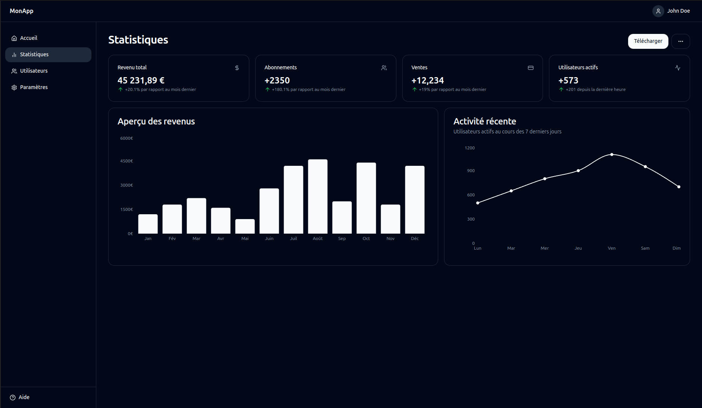
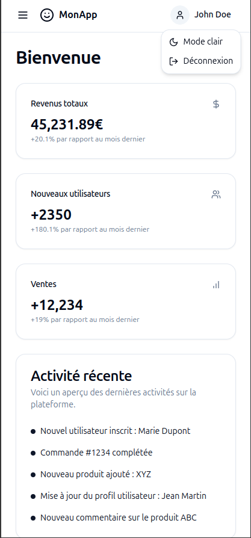

# React-Vite-Architecture

React-Vite-Architecture is a foundational project for building scalable web applications using **Vite**, **React**, **TailwindCSS**, and **ShadCN UI components**. The current setup is a dashboard, but it's easily reusable and adaptable for other types of applications.






## Features

- **Vite**: Ultra-fast development build system for modern web apps.
- **React**: Powerful UI library for building interactive user interfaces.
- **TailwindCSS**: A utility-first CSS framework for rapid UI development.
- **ShadCN UI**: Beautifully crafted UI components, with customization built-in.
- **Lucide Icons**: Modern icons for intuitive navigation and feature representation.
- **React Router**: Built-in routing to navigate between views.
- **TypeScript**: Full TypeScript support for type safety and autocompletion.

## Folder Structure

src
├── assets # Static assets like images and logos
├── components # Reusable UI components (buttons, cards, etc.)
├── contexts # Global contexts (e.g., AuthContext, AppContext)
├── layouts # Layout components for wrapping page content
├── pages # Different pages of the app (Home, Dashboard, etc.)
├── main.tsx # App entry point$

## Usage

The project is configured as a **dashboard**, which includes basic components like a sidebar, top bar, cards for statistics, and recent activities. However, the structure is flexible and allows for easy adaptation into other types of applications.

### Example: Reusing the Architecture

You can use the same folder structure and components to create other types of applications, such as:

- **E-commerce platform**: Replace the dashboard components with product listings, shopping cart, and order history.
- **Blog**: Use components to display posts, author profiles, and comments.
- **SaaS Application**: Manage features like user authentication, billing, and analytics using the current setup.

## Getting Started

1. Clone the repository:

   ```bash
   git clone https://github.com/your-username/react-vite-architecture.git
   cd react-vite-architecture
   ```

2. Install dependencies:

   ```bash
   npm install
   ```

3. Run the development server:

   ```bash
   npm run dev
   ```

4. Build for production:

   ```bash
   npm run build
   ```

## Customization

### TailwindCSS

TailwindCSS is fully set up with default configurations. You can easily modify the design system by adjusting the `tailwind.config.js` file or adding custom utility classes in your components.

### ShadCN UI

Components from **ShadCN UI** are ready to use and are fully customizable to match your branding or design requirements.
